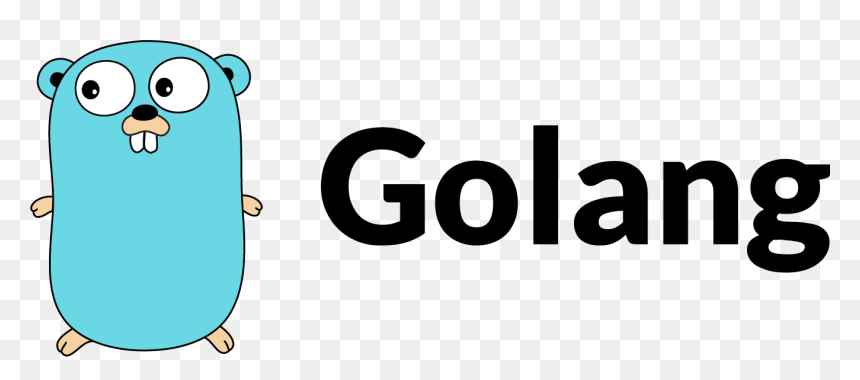

# Fandom_Golang

 
[](./LICENSE)  
[](#)

> ⚙️ Dự án **Fandom_Golang** – Backend mạnh mẽ toàn diện với Go, phục vụ hệ thống fandom, cộng đồng người hâm mộ & fanclub.

## 🧑‍💼 Tác giả – PM/Dev xịn  

**Quách Thành Long**  
[quachthanhlong.com](https://quachthanhlong.com) – nơi cập nhật blog, dự án và hành trình dev của mình.

---

## 🚀 Giới thiệu  
Fandom_Golang là một nền tảng backend được viết bằng Go (Golang) – nhằm xây dựng hệ thống quản lý fandom, người dùng, bài viết, bình luận, tương tác, và phân quyền. Dự án được thiết kế hướng tới:

- Tốc độ nhanh, hiệu suất cao – tận dụng ưu thế của Go  
- Kiến trúc rõ ràng, dễ mở rộng  
- API RESTful hoặc GraphQL (tuỳ triển khai) cho frontend sử dụng  
- Hỗ trợ cơ sở dữ liệu quan hệ và NoSQL (ví dụ PostgreSQL / MongoDB)  
- Logging, monitoring, và bảo mật cơ bản đã tích hợp sẵn

---

## 🛠 Tính năng chính  
- Đăng ký & đăng nhập người dùng (email, password, OAuth …)  
- Quản lý hồ sơ người dùng, ảnh đại diện, thông tin fandom  
- Tạo – đọc – cập nhật – xoá (CRUD) bài viết fandom, chủ đề, thảo luận  
- Bình luận & phản hồi đa cấp (nested comments)  
- Hệ thống “thích”, “chia sẻ”, “theo dõi” fandom  
- Phân quyền người dùng (Admin, Moderator, Member)  
- Tích hợp tìm kiếm nhanh (full-text search)  
- Logging & theo dõi hiệu suất, sử dụng context, middleware Go  
- Triển khai dễ dàng với Docker / Kubernetes / CI/CD

---

## 📦 Công nghệ sử dụng  
- Ngôn ngữ: Go (Golang)  
- Framework HTTP/API: Gin / Echo / Fiber (tuỳ bạn chọn)  
- Cơ sở dữ liệu: PostgreSQL / MySQL hoặc MongoDB  
- ORM / Query Builder: GORM / sqlx hoặc tương đương  
- Migrations: golang-migrate hoặc embedded migrations  
- Autentication & Authorization: JWT, OAuth2, Casbin (tuỳ bạn)  
- Tooling & DevOps: Docker, GitHub Actions, Makefile  
- Logging & Metrics: Zap / Logrus, Prometheus / Grafana  
- Testing: Go testing package, Table-driven tests, Mocking

---

## 🧭 Bắt đầu nhanh  
### 1. Chuẩn bị môi trường  
```bash
git clone https://github.com/StephenSouth13/Fandom_Golang.git
cd Fandom_Golang
2. Cấu hình môi trường
Tạo file .env hoặc config.yaml với các biến như:

ini
Copy code
DB_HOST=localhost
DB_PORT=5432
DB_USER=fandom
DB_PASS=secret
DB_NAME=fandomdb
JWT_SECRET=your_super_secret_key
3. Cài đặt và chạy
bash
Copy code
go mod download
go run main.go
Hoặc nếu dùng Docker:

bash
Copy code
docker-compose up -d
4. Migrations
bash
Copy code
go run cmd/migrate/main.go up
5. Chạy test
bash
Copy code
go test ./...
📁 Cấu trúc thư mục (gợi ý)
csharp
Copy code
├── cmd/
│   └── server/          # entrypoint main.go
├── internal/
│   ├── user/            # module người dùng
│   ├── post/            # module bài viết
│   ├── comment/         # module bình luận
│   └── auth/            # module xác thực
├── pkg/
│   └── util/            # helper, middleware
├── configs/             # file cấu hình
├── migrations/          # db migrations
├── docker/              # docker & compose
└── README.md
📌 Hướng dẫn triển khai
Triển khai lên server EC2 / VPS với Docker.

Sử dụng GitHub Actions để build image & deploy đến Kubernetes / ECS.

Thiết lập monitoring via Prometheus & Grafana.

Sử dụng Nginx làm reverse proxy & SSL via Let’s Encrypt.

🧪 Testing & Code Quality
Viết test dạng table-driven để cover logic business.

Sử dụng golangci-lint để đảm bảo lint & format (gofmt, goimports).

Cover các endpoint bằng httptest và mock các repo/db layer.

📝 Roadmap
 API GraphQL bên cạnh REST

 Real-time chat & notification (via WebSocket)

 Plugin hệ thống fandom tự do mở rộng

 Multi-tenant & micro-services hóa

 Mobile SDK & các function serverless

💡 Góp ý & đóng góp
Mọi đóng góp rất được hoan nghênh!

Fork repo

Tạo branch mới: feature/YourFeature

Commit với nội dung rõ ràng

Mở Pull Request.


📬 Liên hệ
Có thắc mắc hoặc muốn trao đổi?

Website: quachthanhlong.com

Email: stephensouth1307@gmail.com (stephensouth1307@gmail.com)

Twitter / LinkedIn: (https://www.linkedin.com/in/quach-long-338018274/)